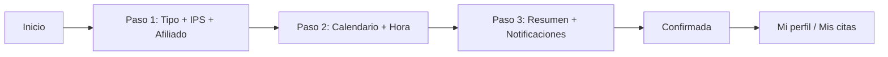
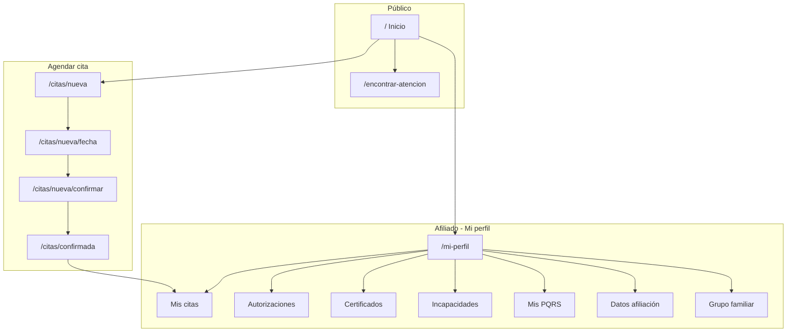

# Arquitectura de información — Nueva EPS

> **Fuente de verdad** para estructura, navegación, flujos y taxonomía del portal.  
> Complementa `MASTER.md` (visual/interacción). Al construir una pantalla, consultar también `pages/[pantalla].md` si existe.

**Proyecto:** Portal afiliado Nueva EPS (prototipo UI/UX)  
**Patrón recomendado:** Enterprise Gateway + Accessible & Ethical (salud pública, WCAG)  
**Última revisión:** 2026-05-18

### Mapa visual (3 pasos)

- **Visual (HTML):** [`information-architecture-map.html`](./information-architecture-map.html)  
- **Informe / Word (MD):** [`information-architecture-map.md`](./information-architecture-map.md)

Sigue el método de [UI from Mars — Arquitectura de la información](https://uifrommars.com/arquitectura-de-la-informacion/):

1. **Inventario** — tarjetas de contenido y funciones  
2. **Agrupación** — card sorting por áreas de negocio  
3. **Mapa por niveles** — jerarquía con colores (estilo Nielsen Norman)

---

## 1. Propósito y alcance

### 1.1 Objetivo del producto

Permitir que un **afiliado** (contributivo o subsidiado) resuelva necesidades de salud sin fricción:

- Agendar y consultar citas médicas
- Encontrar puntos de atención (IPS, farmacias, urgencias)
- Gestionar trámites y documentos (autorizaciones, certificados, incapacidades, PQRS)
- Consultar datos de afiliación y grupo familiar

### 1.2 Usuarios primarios

| Persona | Necesidad principal | Contexto |
|---------|---------------------|----------|
| Afiliado activo | Agendar cita o ver citas existentes | Móvil, poco tiempo |
| Afiliado con trámite | Estado de autorización / certificado | Escritorio o móvil |
| Familiar / cuidador | Cita para beneficiario del grupo | Flujo paso 1 (afiliado) |
| Visitante no autenticado | Explorar servicios y localizar IPS | Inicio sin sesión |

### 1.3 Alcance del prototipo actual

| Estado | Descripción |
|--------|-------------|
| **Implementado** | Inicio, agendamiento (3 pasos + éxito), perfil (Mis citas), localizador IPS |
| **Stub / placeholder** | Autorizaciones, certificados, incapacidades, PQRS, afiliación, grupo familiar; Mis trámites, Ayuda (nav); mapa real |
| **Fuera de alcance** | Backend, login real, pagos, historias clínicas |

---

## 2. Modelo mental

```
Portal Nueva EPS
├── Público (sin sesión obligatoria en prototipo)
│   └── Inicio → descubrir + buscar + accesos rápidos
├── Transaccional
│   └── Agendar cita (flujo lineal 3 pasos)
├── Consulta / autoservicio
│   └── Mi perfil (hub de servicios del afiliado)
└── Ubicación
    └── Encontrar atención (red prestadora)
```

**Regla de navegación:** máximo **3 clics** desde Inicio hasta cualquier tarea frecuente (cita, IPS, mis citas).

---

## 3. Mapa del sitio (sitemap)

### 3.1 Árbol completo (objetivo de producto)

```
/  Inicio
├── /citas/nueva                    [Paso 1: Datos de la cita]
│   ├── /citas/nueva/fecha          [Paso 2: Fecha y hora]
│   ├── /citas/nueva/confirmar      [Paso 3: Confirmación]
│   └── /citas/confirmada           [Éxito]
├── /mi-perfil                      [Hub afiliado]
│   ├── ?tab=mis-citas              [Implementado — ruta única + estado]
│   ├── ?tab=autorizaciones         [Planificado]
│   ├── ?tab=certificados           [Planificado]
│   ├── ?tab=incapacidades          [Planificado]
│   ├── ?tab=pqrs                   [Planificado]
│   ├── ?tab=afiliacion             [Planificado]
│   └── ?tab=grupo-familiar         [Planificado]
├── /encontrar-atencion             [Localizador]
├── /tramites                       [Planificado — nav "Mis trámites"]
├── /ayuda                          [Planificado — nav "Ayuda"]
└── Footer (enlaces planificados)
    ├── Política de privacidad
    ├── Mapa del sitio
    └── Accesibilidad
```

### 3.2 Rutas implementadas hoy (`App.jsx`)

| Ruta | Pantalla | Nivel | Nav principal |
|------|----------|-------|---------------|
| `/` | Inicio | 1 | Inicio |
| `/encontrar-atencion` | Localizador IPS | 1 | Encontrar atención |
| `/mi-perfil` | Perfil (tabs internos) | 1 | Mis servicios |
| `/citas/nueva` | Agendar paso 1 | 2 (flujo) | — (back: Inicio) |
| `/citas/nueva/fecha` | Agendar paso 2 | 3 (flujo) | — |
| `/citas/nueva/confirmar` | Agendar paso 3 | 4 (flujo) | — |
| `/citas/confirmada` | Confirmación | 2 (post-flujo) | — |

---

## 4. Sistemas de navegación

### 4.1 Navegación global (header — `Nav.jsx`)

**Desktop (≥ md):**

| Elemento | Destino | Estado |
|----------|---------|--------|
| Logo NUEVA EPS | `/` | Activo |
| Inicio | `/` | Activo |
| Mis servicios | `/mi-perfil` | Activo |
| Encontrar atención | `/encontrar-atencion` | Activo |
| Mis trámites | — | Placeholder (sin enlace) |
| Ayuda | — | Placeholder (sin enlace) |
| Iniciar sesión / Usuario | `/mi-perfil` | Simulado (mockUser) |

**Mobile:** menú hamburguesa con Inicio, Mis servicios, Encontrar atención + CTA Entrar/Usuario.

**Modo secundario (`backLink`):** en flujos internos (perfil, citas, localizador) → enlace «← Inicio» o «← Volver al inicio» sustituye el menú expandido.

### 4.2 Navegación local — Perfil (`ProfileSidebar`)

| Ítem (orden) | ID sugerido | Estado prototipo |
|--------------|-------------|------------------|
| Mis citas | `mis-citas` | ✅ Lista + agendar |
| Autorizaciones | `autorizaciones` | 🔜 Placeholder |
| Certificados | `certificados` | 🔜 Placeholder |
| Incapacidades | `incapacidades` | 🔜 Placeholder |
| Mis PQRS | `pqrs` | 🔜 Placeholder |
| Datos de afiliación | `afiliacion` | 🔜 Placeholder |
| Grupo familiar | `grupo-familiar` | 🔜 Placeholder |

**Mobile:** drawer lateral izquierdo (botón menú en contenido).  
**Desktop:** sidebar fijo 220px.

### 4.3 Navegación de flujo — Agendar cita

| Paso | Título UI | Guard | Retroceso |
|------|-----------|-------|-----------|
| 1 | ¿Qué tipo de cita necesitas? | `RequireStep1` (datos completos) | ← Volver al inicio |
| 2 | Fecha y hora | `RequireStep2` (slot seleccionado) | Paso anterior |
| 3 | Confirmar | Contexto booking | Paso anterior |
| Éxito | Cita confirmada | — | Ver mis citas / Inicio |

Indicador: `StepIndicator` (3 pasos visibles).

### 4.4 Navegación local — Localizador

- Búsqueda por ciudad/dirección
- Filtros: Todos | IPS | Farmacia | Urgencias
- Lista de resultados + mapa (placeholder)
- Sin tabs; vista única split panel (sidebar + mapa)

### 4.5 Accesos rápidos — Inicio (`QuickAccessGrid`)

| Tarjeta | Destino actual | Alternativa futura |
|---------|----------------|-------------------|
| Agendar cita | `/citas/nueva` | — |
| Mis autorizaciones | Toast «Próximamente» | `/mi-perfil?tab=autorizaciones` |
| Mis certificados | Toast «Próximamente» | `/mi-perfil?tab=certificados` |
| Encontrar IPS | `/encontrar-atencion` | — |

**Buscador hero:** filtra tarjetas por keywords (no busca en todo el sitio).

---

## 5. Taxonomía de contenido

### 5.1 Tipos de contenido (content types)

| Tipo | Ejemplos | Ubicación |
|------|----------|-----------|
| **Página hub** | Inicio, Mi perfil | Nivel 1 |
| **Flujo transaccional** | Agendar cita | Secuencia lineal |
| **Listado + detalle** | Citas, ubicaciones IPS | Perfil / Localizador |
| **Formulario** | Paso 1 y 3 booking | Citas |
| **Informativo estático** | Régimen, urgencias, líneas | InfoGrid en Inicio |
| **Estado vacío / placeholder** | Secciones futuras perfil | Perfil tabs |
| **Feedback** | Toast, éxito cita | Global / post-flujo |

### 5.2 Metadatos de cita (dominio)

```
Cita
├── id
├── consultType      (Medicina general, Especialista, …)
├── ips
├── affiliate        (titular | familiar)
├── date / time
├── status           (Confirmada | Pendiente | Pasada)
└── authorizationNo  (post-confirmación)
```

Persistencia prototipo: `localStorage` (`appointmentsStorage`).

### 5.3 Metadatos de ubicación (dominio)

```
Ubicación
├── id, name, type (IPS | Farmacia | Urgencias)
├── address, city, hours
└── distance (km, mock)
```

---

## 6. Flujos de usuario principales

### 6.1 Flujo A — Agendar cita (crítico)



**Puntos de salida:** Inicio (back), abandono (sin guardar borrador).  
**Éxito:** cita en `localStorage` + pantalla con número de autorización mock.

### 6.2 Flujo B — Consultar citas

```
Inicio → Mis servicios (/mi-perfil) → Mis citas (default)
       → [opcional] + Agendar nueva cita → Flujo A
```

### 6.3 Flujo C — Encontrar atención

```
Inicio → Encontrar IPS | Nav "Encontrar atención"
       → Buscar / Filtrar → Seleccionar en lista → Mapa highlight
```

### 6.4 Flujo D — Explorar sin sesión

```
Inicio → Accesos rápidos / Info régimen
       → Iniciar sesión (simulado → /mi-perfil)
```

---

## 7. Jerarquía de etiquetas y lenguaje

### 7.1 Convenciones de naming

| Contexto | Convención | Ejemplo |
|----------|------------|---------|
| Nav global | Verbo/sustantivo corto, sin jerga | «Encontrar atención» |
| Hub perfil | «Mis …» posesivo | Mis citas, Mis PQRS |
| CTAs primarios | Acción clara | Agendar nueva cita, Confirmar cita |
| Estados | Adjetivo en español | Confirmada, Pendiente, Pasada |
| Back links | Flecha + destino | ← Inicio |

### 7.2 Jerarquía de encabezados (por pantalla)

| Pantalla | h1 | h2+ |
|----------|----|-----|
| Inicio | ¿Qué necesitas hoy? (hero) | Tarjetas acceso rápido |
| Perfil | Nombre del tab activo | — (cards citas) |
| Booking | Título del paso | Labels de formulario |
| Localizador | (implícito en UI) | Nombre IPS en card |

---

## 8. Arquitectura responsive

| Breakpoint | Comportamiento IA |
|------------|-----------------|
| `< md` | Nav colapsado; perfil con drawer; grid 2 cols en accesos rápidos |
| `≥ md` | Nav horizontal; sidebar perfil fijo; localizador 280px + mapa |
| Contenido | `overflow-x-hidden` en perfil; drawer con `display: contents` (sin hueco superior) |

**Touch:** objetivos mín. 44×44px en tabs y botones de menú.

---

## 9. Matriz pantalla × componentes

| Pantalla | Layout shell | Componentes clave |
|----------|--------------|-------------------|
| Inicio | PageShell + Footer | HeroSearch, QuickAccessGrid, InfoGrid |
| Perfil | PageShell, sin footer | ProfileSidebar, ProfileMenuButton, AppointmentCard |
| Booking ×3 | PageShell, sin footer | StepIndicator, ActionBar, CalendarPicker, ConfirmSummary |
| Localizador | PageShell, sin footer | LocatorSidebar, MapPlaceholder |
| Éxito cita | PageShell | Resumen + CTAs |

---

## 10. Estados, reglas y anti-patrones

### 10.1 Reglas de negocio (prototipo)

1. No avanzar en booking sin completar paso anterior (`BookingRouteGuard`).
2. Citas nuevas se anexan al listado de Mis citas tras confirmar.
3. Accesos sin ruta muestran toast «Próximamente en el prototipo» (no navegar a 404).

### 10.2 Anti-patrones a evitar (ui-ux-pro-max)

- Emojis como iconos de UI en producción → SVG (Lucide/Heroicons).
- Más de 7±2 ítems visibles en nav móvil sin agrupación.
- Mezclar «Mis servicios» (nav) con tabs de perfil sin coherencia.
- Scroll horizontal en viewport completo.
- Omitir `aria-current`, `aria-expanded` en menús y drawers.

---

## 11. Roadmap de IA (cerrar gaps)

| Prioridad | Ítem | Acción sugerida |
|-----------|------|-----------------|
| P0 | Tabs perfil sin URL | Query `?tab=` o rutas hijas `/mi-perfil/autorizaciones` |
| P0 | Mis trámites / Ayuda | Definir sitemap y enlazar en Nav |
| P1 | Autorizaciones / Certificados | Enlazar QuickAccess → tab perfil |
| P1 | Breadcrumbs en flujo citas | Inicio > Agendar > Paso N |
| P2 | Mapa del sitio (footer) | Página estática desde este documento |
| P2 | Login real | Separar área pública vs autenticada en sitemap |

---

## 12. Referencias cruzadas

| Documento | Uso |
|-----------|-----|
| `design-system/nueva-eps/MASTER.md` | Color, tipo, componentes, checklist |
| `design-system/nueva-eps/pages/*.md` | Overrides por pantalla |
| `README.md` | Rutas técnicas y demo |
| `src/App.jsx` | Implementación de rutas |

---

## Apéndice A — Diagrama de sitemap (Mermaid)


