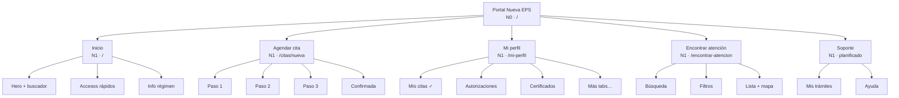

# Arquitectura de información — Nueva EPS
## Documento para informe (prototipo UI/UX)

**Proyecto:** Portal afiliado Nueva EPS  
**Versión:** Prototipo funcional · 2026  
**Metodología:** Inventario → Agrupación (card sorting) → Mapa por niveles  
**Referencia:** [Arquitectura de la información — UI from Mars](https://uifrommars.com/arquitectura-de-la-informacion/) · Morville & Rosenfeld

**Mapa visual interactivo:** `information-architecture-map.html`  
**Documentación técnica ampliada:** `INFORMATION-ARCHITECTURE.md`  
**Mapa de viaje (journey):** `../journey_map.html` · `../journey_map.md`

---

## Resumen ejecutivo

La arquitectura de información (AI) del portal organiza cómo el afiliado **encuentra**, **entiende** y **completa** tareas de salud: agendar citas, consultar trámites, localizar IPS y gestionar su perfil. No es solo un listado de URLs: define **relaciones**, **jerarquías** y **agrupaciones** según el modelo mental del usuario.

En el prototipo actual están implementadas las rutas críticas (Inicio, agendamiento en 3 pasos, Mis citas, localizador). El resto de secciones del hub «Mi perfil» y la navegación global (Mis trámites, Ayuda) están planificadas.

---

## Pilares de la arquitectura (Morville)

| Pilar | Descripción |
|-------|-------------|
| **Contexto** | Portal EPS en Colombia: afiliados contributivos y subsidiados, trámites de salud, red prestadora (IPS, farmacias, urgencias). |
| **Usuarios** | Afiliado activo, familiar/cuidador, visitante sin sesión. Prioridad: móvil y tareas en pocos pasos. |
| **Contenido** | Citas médicas, ubicaciones, autorizaciones, certificados, incapacidades, PQRS, datos de afiliación, grupo familiar y ayuda. |

---

## Proceso en 3 pasos

### Paso 1 — Inventario de contenidos y funciones

Listado de todo lo que el producto debe ofrecer (equivalente a las «tarjetas» del ejercicio inicial).

| Ítem | Estado en prototipo |
|------|---------------------|
| Inicio + buscador | Implementado |
| Agendar cita | Implementado |
| Mis citas | Implementado |
| Encontrar IPS / farmacia / urgencias | Implementado |
| Autorizaciones | Planificado |
| Certificados | Planificado |
| Incapacidades | Planificado |
| Mis PQRS | Planificado |
| Datos de afiliación | Planificado |
| Grupo familiar | Planificado |
| Mis trámites (nav global) | Planificado |
| Ayuda (nav global) | Planificado |
| Política de privacidad / Accesibilidad (footer) | Planificado |

---

### Paso 2 — Agrupación (card sorting)

Agrupación según dónde el usuario espera encontrar cada ítem al perseguir un objetivo.

#### Grupo: Público · Descubrimiento

| Ítem | Estado |
|------|--------|
| Inicio | Implementado |
| Accesos rápidos | Implementado |
| Información por régimen / urgencias / líneas | Implementado |

#### Grupo: Transaccional · Citas

| Ítem | Estado |
|------|--------|
| Paso 1 — Tipo de cita, IPS, afiliado | Implementado |
| Paso 2 — Fecha y hora | Implementado |
| Paso 3 — Confirmación y notificaciones | Implementado |
| Pantalla de éxito | Implementado |

#### Grupo: Hub afiliado · Mi perfil

| Ítem | Estado |
|------|--------|
| Mis citas | Implementado |
| Autorizaciones | Planificado |
| Certificados | Planificado |
| Incapacidades | Planificado |
| Mis PQRS | Planificado |
| Datos de afiliación | Planificado |
| Grupo familiar | Planificado |

#### Grupo: Ubicación · Red de atención

| Ítem | Estado |
|------|--------|
| Búsqueda por ciudad o dirección | Implementado |
| Filtros (IPS, farmacia, urgencias) | Implementado |
| Lista de sedes + mapa | Implementado (mapa placeholder) |

#### Grupo: Soporte

| Ítem | Estado |
|------|--------|
| Mis trámites | Planificado |
| Ayuda | Planificado |
| Enlaces legales y accesibilidad | Planificado |

---

### Paso 3 — Mapa por niveles (jerarquía con color)

La arquitectura se representa en **niveles** (N0 a N4). En el mapa visual HTML, cada nivel tiene un color distinto (estilo diagramas tipo Nielsen Norman).

#### Leyenda de niveles

| Nivel | Nombre | Color (referencia) | Significado |
|-------|--------|-------------------|-------------|
| N0 | Raíz | Azul nav `#154360` | Portal completo |
| N1 | Áreas principales | Azul primario `#1A5276` | Secciones de primer nivel |
| N2 | Secciones / hubs | Azul medio `#2874A6` | Subáreas dentro de un hub |
| N3 | Pantallas | Azul claro `#5DADE2` | Vistas concretas |
| N4 | Tabs / detalle | Azul muy claro `#AED6F1` | Pestañas o detalle dentro de una pantalla |

| Estado | Significado |
|--------|-------------|
| Implementado | Disponible en el prototipo React |
| Planificado | Definido en IA; mensaje «versión futura» o sin enlace |

---

## Árbol de arquitectura (texto)

```
Portal Nueva EPS  [N0 · /]
│
├── Inicio  [N1 · /]
│   ├── Hero + buscador  [N3]
│   ├── Accesos rápidos  [N3]
│   └── Información por régimen  [N3]
│
├── Agendar cita  [N1 · /citas/nueva]
│   ├── Paso 1 — Datos de la cita  [N3]
│   ├── Paso 2 — Fecha y hora  [N3]
│   ├── Paso 3 — Confirmar  [N3]
│   └── Cita confirmada  [N3 · /citas/confirmada]
│
├── Mi perfil  [N1 · /mi-perfil]
│   ├── Mis citas  [N4] ✓ Implementado
│   ├── Autorizaciones  [N4] Planificado
│   ├── Certificados  [N4] Planificado
│   ├── Incapacidades  [N4] Planificado
│   ├── Mis PQRS  [N4] Planificado
│   ├── Datos de afiliación  [N4] Planificado
│   └── Grupo familiar  [N4] Planificado
│
├── Encontrar atención  [N1 · /encontrar-atencion]
│   ├── Búsqueda  [N3]
│   ├── Filtros por tipo  [N3]
│   └── Lista de sedes + mapa  [N3]
│
└── Soporte  [N1] Planificado
    ├── Mis trámites  [N3]
    ├── Ayuda  [N3]
    └── Legal / Accesibilidad  [N3]
```

---

## Diagrama jerárquico (Mermaid)

*Pegar en Word vía «Insertar → Diagrama» si el editor lo admite, o usar captura del HTML visual.*



---

## Flujos principales de usuario

### Flujo A — Agendar cita (crítico)

**Inicio** → **Agendar (paso 1)** → **Fecha y hora (paso 2)** → **Confirmar (paso 3)** → **Cita confirmada** → **Mis citas**

| Etapa | Ruta | Objetivo del usuario |
|-------|------|----------------------|
| Entrada | `/` o acceso rápido | Decidir agendar |
| Datos | `/citas/nueva` | Tipo, IPS, afiliado |
| Calendario | `/citas/nueva/fecha` | Elegir día y hora |
| Revisión | `/citas/nueva/confirmar` | Validar y activar recordatorios |
| Éxito | `/citas/confirmada` | Obtener confirmación |
| Seguimiento | `/mi-perfil` (Mis citas) | Ver cita guardada |

### Flujo B — Encontrar atención

**Inicio** → **Encontrar IPS** → **Buscar / filtrar** → **Seleccionar sede en lista**

| Etapa | Ruta |
|-------|------|
| Entrada | `/` o `/encontrar-atencion` |
| Exploración | Filtros: Todos, IPS, Farmacia, Urgencias |
| Resultado | Lista ordenada por distancia + mapa |

### Flujo C — Consultar mis citas

**Inicio** → **Mis servicios** → **Mis citas** → (opcional) **Agendar nueva cita**

---

## Navegación global

| Elemento (header) | Destino | Estado |
|-------------------|---------|--------|
| Logo NUEVA EPS | `/` | Activo |
| Inicio | `/` | Activo |
| Mis servicios | `/mi-perfil` | Activo |
| Encontrar atención | `/encontrar-atencion` | Activo |
| Mis trámites | — | Planificado |
| Ayuda | — | Planificado |
| Iniciar sesión / Usuario | `/mi-perfil` | Simulado (mock) |

**Modo secundario:** en flujos internos aparece «← Inicio» o «← Volver al inicio» en lugar del menú completo.

---

## Rutas implementadas (código)

| Ruta | Pantalla |
|------|----------|
| `/` | Inicio |
| `/encontrar-atencion` | Localizador IPS |
| `/mi-perfil` | Perfil del afiliado |
| `/citas/nueva` | Agendar — paso 1 |
| `/citas/nueva/fecha` | Agendar — paso 2 |
| `/citas/nueva/confirmar` | Agendar — paso 3 |
| `/citas/confirmada` | Confirmación de cita |

---

## Diferencia entre AI, sitemap y navegación

| Concepto | Qué es | En este proyecto |
|----------|--------|------------------|
| **Arquitectura de información** | Organización, etiquetas y relaciones entre contenidos | Este documento + mapa HTML |
| **Sitemap** | Listado de URLs/páginas | Sección «Árbol» y tabla de rutas |
| **Navegación** | Enlaces y menús que guían al usuario | Nav global, sidebar perfil, drawer móvil |

---

## Notas para pegar en Microsoft Word

1. Abrir este archivo `.md` en VS Code, Cursor o un visor Markdown y copiar todo.
2. En Word: **Pegar → Mantener solo texto** o usar *Pandoc*:  
   `pandoc information-architecture-map.md -o informe-ia-nueva-eps.docx`
3. Para el diagrama en color, abrir `information-architecture-map.html` en el navegador, capturar pantalla de la sección «Paso 3» e insertar como imagen en el informe.
4. Título sugerido del informe: *Arquitectura de información — Portal Nueva EPS (prototipo UI/UX)*.

---

## Referencias

- UI from Mars — [Arquitectura de la información: qué es y cómo hacerlo](https://uifrommars.com/arquitectura-de-la-informacion/)
- Morville, P. & Rosenfeld, L. — *Information Architecture for the World Wide Web*
- Repositorio: `design-system/nueva-eps/INFORMATION-ARCHITECTURE.md`

---

*Documento generado a partir de `information-architecture-map.html` · Nueva EPS · Prototipo UI/UX*
